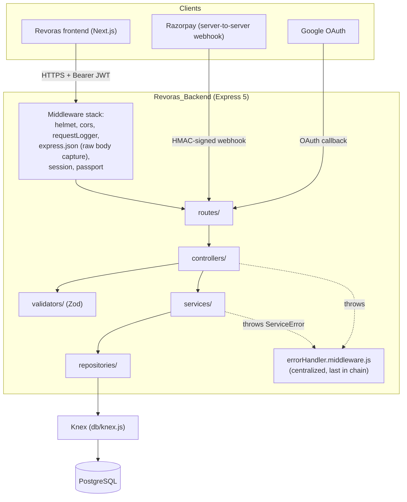

# Backend Architecture

## System overview



## Layered pattern: `routes → controllers → services → repositories → Knex`

Every domain in this codebase follows the same five-layer pattern, with no exceptions (verified by repo-wide grep as of the Phase 2.5 production-readiness audit: zero `pool.query()`, zero raw SQL string-building outside parameterized `db.raw()` calls).

| Layer | Responsibility | Never does |
|---|---|---|
| **`routes/`** | Wires URL + HTTP method → middleware chain → controller function. Owns the middleware ordering (rate limit → auth → membership → permission). | Business logic, validation, DB queries |
| **`controllers/`** | Thin HTTP adapters: parse/validate `req` via a Zod schema, call one service function, shape the JSON response. No `try/catch` — Express 5 forwards rejected async-handler promises to `errorHandler.middleware.js` automatically. | Business logic, direct DB access, permission checks |
| **`validators/`** | One Zod schema module per domain (`*.validator.js`) — the single source of truth for what a request body/query must look like. | Anything beyond shape validation |
| **`services/`** | All business logic: orchestration, transactions, invariants (e.g. "can't remove the last owner"), calls to external providers (Razorpay, Nominatim geocoding). Throws `ServiceError(statusCode, message)` for expected failure cases. **Holds no permission/role logic** — that's routing-layer (`requirePermission`), a deliberate architectural rule from the RBAC migration. | Talk to `req`/`res` directly, raw SQL |
| **`repositories/`** | All Knex queries for one table/domain. Every exported function accepts an optional `db`/`trx` parameter (defaults to the shared `knex` instance) so the same repository function works both standalone and inside a transaction. | Business logic, validation |

```
Request → rate limiter → authenticate → [requireBusinessMember → requirePermission] → controller
             ↓                                                                              ↓
        (429 if exceeded)                                                          validator.parse(req.body)
                                                                                              ↓
                                                                                       service.doThing()
                                                                                              ↓
                                                                                    repository.query(trx?)
                                                                                              ↓
                                                                                            Knex → Postgres
```

## Folder-by-folder

```
Revoras_Backend/
├── db/
│   ├── knex.js              # the one Knex instance, exported as default
│   ├── migrations/          # versioned schema (see database-schema.md)
│   └── seeds/                # roles, permissions, role_permissions, categories, dev admin, dev fixtures
├── docs/                     # this documentation set
├── src/
│   ├── server.js             # app bootstrap: middleware stack, route mounting, error handler, listen
│   ├── config/
│   │   ├── passport.js       # Google OAuth strategy
│   │   └── razorpay.js       # Razorpay client + isRazorpayConfigured() guard
│   ├── routes/                # one file per domain, see api-reference.md for the full mount table
│   ├── controllers/           # thin HTTP adapters, one file per domain
│   ├── validators/            # Zod schemas, one file per domain
│   ├── services/              # business logic, one file per domain
│   ├── repositories/          # Knex queries, one file per domain
│   ├── middlewares/
│   │   ├── authenticate.middleware.js      # Person JWT verification (customer/business)
│   │   ├── auth.middleware.js              # Admin JWT verification + requireAdmin + optionalAuth
│   │   ├── businessMember.middleware.js    # requireBusinessMember (membership check)
│   │   ├── requirePermission.middleware.js # DB-driven permission-key check
│   │   ├── rateLimit.middleware.js         # in-memory per-scope rate limiter
│   │   ├── requestLogger.middleware.js     # structured request/response logging
│   │   └── errorHandler.middleware.js      # centralized error → HTTP response translation
│   └── utils/
│       ├── ServiceError.js   # the one typed error class services throw
│       ├── logger.js         # structured JSON logger
│       ├── validation.js
│       └── dbSchema.js
├── uploads/                   # static file serving mount (/uploads)
├── knexfile.js                 # Knex environment config (development/test/production)
├── Dockerfile                  # exists but unaudited - see PRODUCTION_READINESS.md H3
├── Jenkinsfile                 # exists but unaudited - see PRODUCTION_READINESS.md H3
└── package.json
```

Note: `src/controller/` (singular) — the pre-clean-architecture directory — no longer exists. Everything lives in `src/controllers/` (plural) as of the Phase 2.5 Admin migration, the last domain to move over.

## Error handling

One rule, applied everywhere: **controllers never `try`/`catch`.** Express 5 automatically forwards a rejected promise from an async route handler to the next error-handling middleware, which in this codebase is always `errorHandler.middleware.js`, registered last in `server.js`.

```js
// errorHandler.middleware.js, simplified
if (err instanceof ServiceError) return res.status(err.statusCode).json({ error: err.message });
if (err instanceof ZodError) return res.status(400).json({ error: "Validation failed", details: [...] });
logger.error("Unhandled request error", err);
res.status(500).json({ error: "Internal server error" });
```

Services signal expected failures by throwing `new ServiceError(statusCode, message)` (e.g. `404` not found, `409` conflict, `400` bad input) — never by returning an error object or a sentinel value. Anything else (a genuine bug, a DB connection drop) falls through to a logged, generic `500`.

**One refinement worth restating** (found and fixed during the Customer Features migration phase, easy to reintroduce by accident): any side effect fired *after* an operation has already committed (notifications, in this codebase) must catch-and-log its own failures internally, never let them propagate — otherwise a genuinely successful booking/payment would surface to the client as a `500` just because the follow-up notification failed. See the `notifySafely` pattern in `booking.service.js` and the inline try/catch in `payment.service.js#notifyPaymentSuccess`.

## Request/response conventions

Verified by reading every controller across all domains:
- **Single resource**: `{ resourceName: {...} }`
- **List**: `{ resourceNamePlural: [...], pagination: { page, limit, total, pages } }`
- **Mutation**: `{ message, resourceName }`
- **Error**: always `{ error: "message" }`, or `{ error: "Validation failed", details: [...] }` for a Zod failure — one shape, funneled through `errorHandler.middleware.js`, no controller reinvents its own.
- **HTTP status codes**: `400` validation, `401` authentication, `403` authorization, `404` not found, `409` conflict/duplicate, `500` unhandled, `502` upstream failure (e.g. email send), `503` service not configured (e.g. Razorpay/DB unreachable).

## Identity model (why routing looks the way it does)

Two identities only — see [`auth-flow.md`](./auth-flow.md) for the full flow:
1. **Person** (`users` table) — customers and business owners/staff share one identity, one JWT shape, one `authenticate` middleware. A person's role/permissions at a given business are never baked into the token; they're resolved fresh from `business_members`/`role_permissions` on every request that needs them (see [`rbac-model.md`](./rbac-model.md)).
2. **Admin** (`admins` table) — deliberately separate identity, JWT shape, login endpoint, and middleware (`authenticateAdmin`/`requireAdmin`), isolated from the Business permission model on purpose.

A **Business never authenticates** — it has no password, no login. Only people (via `business_members`) do.
