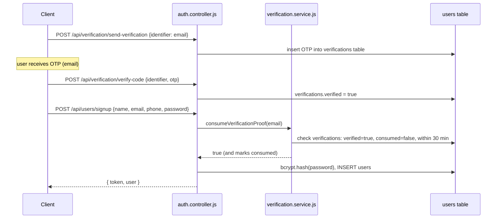
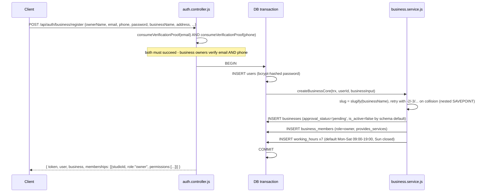
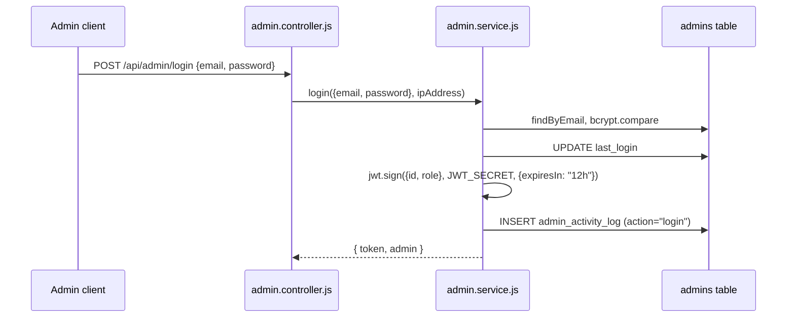

# Authentication Flow

Source: `src/services/auth.service.js`, `src/services/admin.service.js`, `src/middlewares/authenticate.middleware.js`, `src/middlewares/auth.middleware.js`, `src/config/passport.js`.

## Two identities, not four

Revoras has exactly two authentication identities:

1. **Person** (`users` table) — covers both customers and business owners/staff. One table, one JWT shape, one middleware (`authenticate.middleware.js`). A "business login" and a "customer login" both authenticate the same `users` row; what differs is only what the response includes afterward (business memberships, for the business-login page). There is no separate Owner-login/Barber-login split.
2. **Admin** (`admins` table) — a deliberately separate identity, separate JWT shape, separate login endpoint, separate middleware (`auth.middleware.js`'s `authenticateAdmin`). Kept isolated on purpose: a compromised customer or business account has no path to admin privileges.

## JWT shapes

| Identity | Payload | Expiry | Signed with |
|---|---|---|---|
| Person (customer/business) | `{ id, tv }` — `tv` = `users.token_version` | 7 days | `JWT_SECRET` |
| Admin | `{ id, role }` | 12 hours | `JWT_SECRET` (same secret, separate verification path) |

The Person token deliberately carries **no role and no studioId**. Permissions differ per business and must always be resolved fresh from `business_members`/`role_permissions` on every request — never trusted from the token. This is why a permission change (role update, override change) takes effect on a user's very next request, with no re-login required.

There is **no refresh-token rotation** — a deliberate scope decision, not an oversight. Users re-authenticate after the token expires.

## Customer registration & login



`consumeVerificationProof` is single-use and time-boxed (30-minute proof window) — a client-supplied `emailVerified: true` boolean is never trusted; the server always re-checks the `verifications` table itself.

Login (`POST /api/users/login`) is simpler: look up by email or phone, `bcrypt.compare`, issue a token. Both register and login funnel through the shared `authenticateCredentials`/`customerRegister`/`customerLogin` functions in `auth.service.js`.

## Business registration & login

One endpoint each — `POST /api/auth/business/register` and `POST /api/auth/business/login` — used identically by an owner opening their first business and by staff logging into a business they were added to.

**Registration** is a single database transaction (`auth.service.js#businessRegister`):



Note the new business starts `approval_status = 'pending'`, `is_active = false` — it is invisible to customer discovery until an admin approves it (see [`business-onboarding.md`](./business-onboarding.md)).

**Login** authenticates the person once, then resolves **every** active business membership with its effective permissions in a single response:

```json
{
  "token": "...",
  "user": { "id": "...", "name": "...", "email": "..." },
  "memberships": [
    { "studioId": "...", "businessName": "...", "role": "owner", "permissions": ["bookings.manage", "services.manage", "..."] }
  ]
}
```

This lets the frontend pick/display the right dashboard (or a business-switcher, for someone who is staff at one shop and owner of another) without a second round trip.

## Admin login

Separate and simpler — no memberships, no permission resolution, just the two-tier `admin`/`super_admin` role baked directly into the JWT:



## Google OAuth (customer/business, not admin)

`GET /api/auth/google` → Google consent screen → `GET /api/auth/google/callback` (Passport `google` strategy, `src/config/passport.js`). On success, issues the same `{id, tv}` token shape as every other Person login path (unifies to `user.repository.js`, writes `avatar_url`) and redirects the browser to `${FRONTEND_URL}/auth/success?token=...&user=...`.

## Password change / reset (revocation mechanism)

- **`POST /api/auth/change-password`** (authenticated): verifies `currentPassword` with bcrypt, hashes and stores the new one, and **bumps `users.token_version`**.
- **`POST /api/password/forgot-password`** → generates a token, stores its SHA-256 hash in `password_reset_tokens` (never the raw token — a DB read alone can't produce a working reset link), emails a reset link.
- **`POST /api/password/reset-password`** → validates the token hash + expiry + not-consumed, updates the password, marks the token consumed, and **bumps `token_version`**.

**This is the entire revocation mechanism** — there is no token blocklist table. `authenticate.middleware.js` checks the JWT's `tv` claim against the current `users.token_version` on every single request; a token issued before a bump fails with a clean 401 ("Token has been revoked, please log in again"), forcing re-login. Any token issued after a password change/reset is unaffected.

## Account lockout (independent of rate limiting)

`users.failed_login_attempts` / `locked_until` (migration `20260713000001`): **5 failed password attempts locks the account for 15 minutes**, checked in `assertNotLocked()` before the password comparison even runs. This is deliberately independent of `authLimiter`'s per-IP rate limiting (5 requests/15 min, shared across signup/login/register/forgot-password) — an attacker rotating IPs bypasses the IP-based limiter but not this per-account lock. A correct password is still rejected while locked.

## `authenticate` middleware, step by step

Every protected Person-identity route (never admin routes) runs this:

1. Extract `Authorization: Bearer <token>` header — 401 if missing.
2. `jwt.verify(token, JWT_SECRET)` — 401 `"Token expired"` or `"Invalid token"` on failure.
3. Look up `users` by `decoded.id` — 401 if not found.
4. 403 if `is_active === false` (soft-deactivated account).
5. **401 if `decoded.tv !== user.token_version`** (revocation check).
6. Attach a sanitized `req.user` (password/token_version/failed_login_attempts/locked_until stripped) and call `next()`.

This is authentication only — it does not know or care about business membership. See [`rbac-model.md`](./rbac-model.md) for what runs after it on business-scoped routes.
