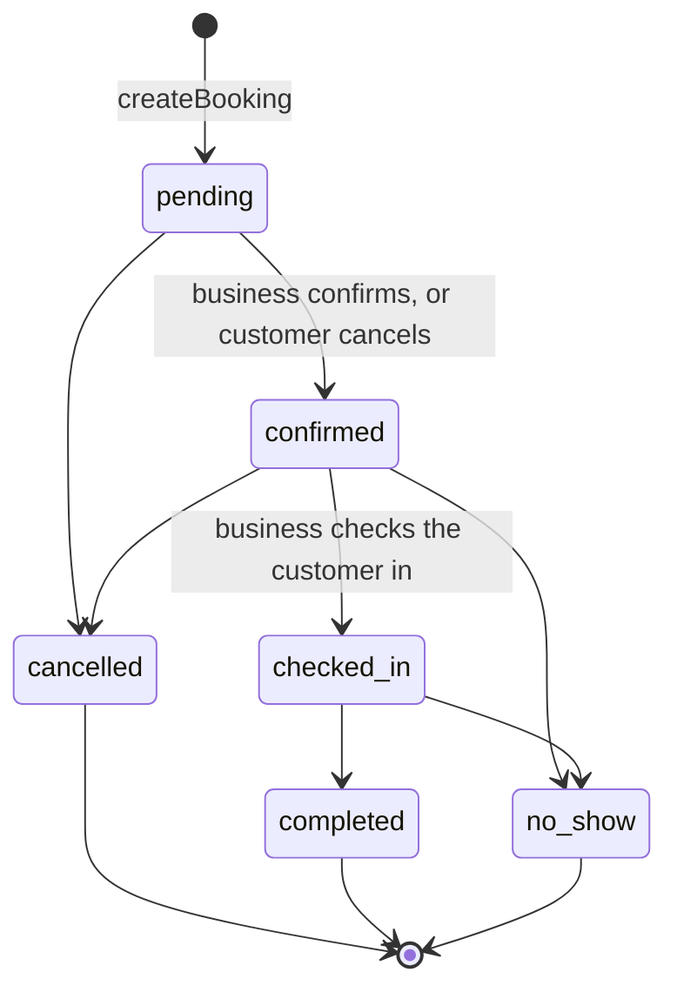
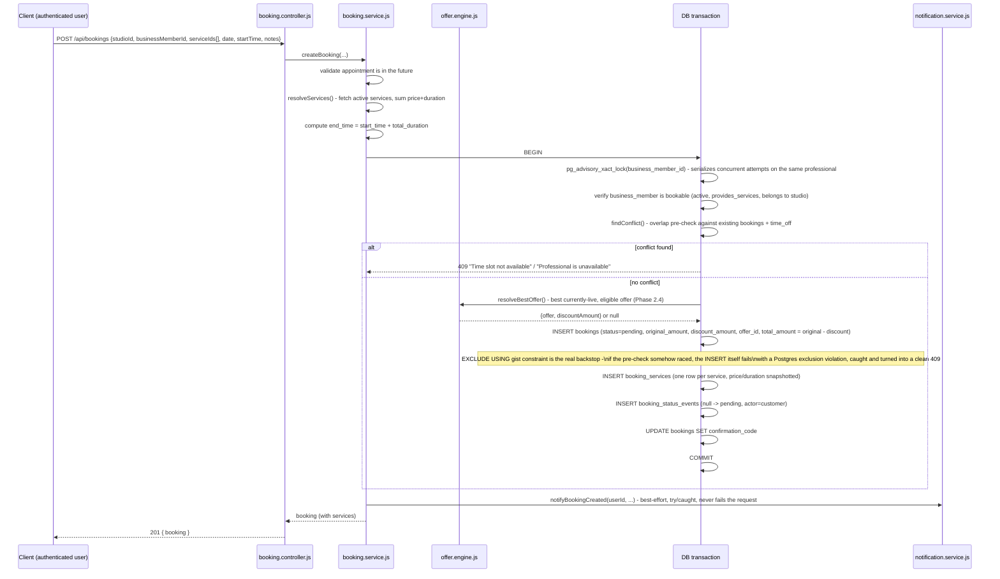
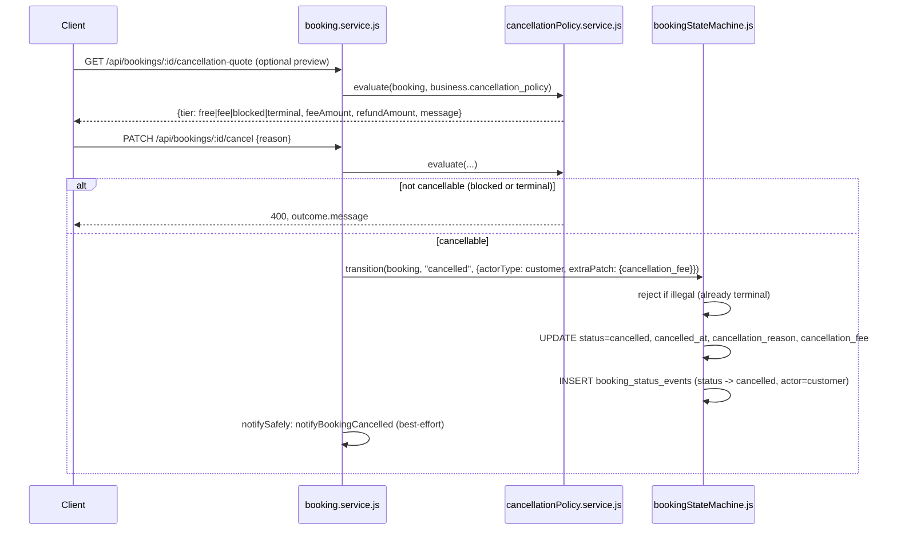

# Booking Lifecycle

Source: `src/services/booking.service.js`, `src/services/bookingStateMachine.js`, `src/services/cancellationPolicy.service.js`, `src/repositories/booking.repository.js`, `db/migrations/20260711000013_create_bookings_table.js`, `db/migrations/20260715000013_booking_lifecycle.js`.

## Status states (Phase 2.5 — the state machine)



`status` is a DB-level `CHECK` constraint: `pending | confirmed | checked_in | completed | cancelled | no_show`. That constraint is only the backstop — the actual authority for *which* transitions are legal is `bookingStateMachine.js`'s `TRANSITIONS` matrix:

```js
pending:    [confirmed, cancelled]
confirmed:  [checked_in, cancelled, no_show]
checked_in: [completed, no_show]
completed / cancelled / no_show: []   // terminal
```

Every status change in the system — the customer cancel path, the business confirm/check-in/complete/no-show path, and the booking-creation event — calls `stateMachine.transition()`. There is no other code path that writes `bookings.status`. An illegal move (e.g. `pending → completed`, skipping confirm and check-in) is rejected with a 400 regardless of who's calling or what permission they hold; nothing is written and no timeline event is logged. This is deliberate: it's what lets completion-rate/no-show-rate metrics (a later phase) trust that a booking only ever moved through legal states.

There is still no automated job that transitions a booking to `completed` or `no_show` after its appointment time passes — those are business actions via `PATCH /business/:studioId/bookings/:id/status` (see [Known gaps](#known-gaps)).

## The timeline (`booking_status_events`)

Every transition — including the initial creation (`from_status: null → pending`) — is appended to `booking_status_events`: `booking_id`, `from_status`, `to_status`, `actor_type` (`customer` | `business` | `system`), `actor_id`, `reason`, `created_at`. `GET /api/bookings/:id/timeline` returns these oldest-first; that's the entire "timeline" feature — no separate per-status timestamp columns.

A reschedule is recorded as a **same-status** event (`from_status === to_status`, e.g. `confirmed → confirmed`) with a `reason` describing the new time, so it shows up on the timeline without looking like a status change.

## Creating a booking



### Double-booking prevention (belt and suspenders)

Two independent layers, not one:

1. **Application pre-check**: inside the transaction, after taking a `pg_advisory_xact_lock` keyed on `business_member_id` (serializes concurrent booking attempts against the *same* professional — a second simultaneous request blocks until the first transaction commits or rolls back), the service queries for any overlapping booking/time-off and throws a 409 before even attempting the insert.
2. **Database constraint** (the actual guarantee): `bookings` has a Postgres `EXCLUDE USING gist` constraint that makes a genuinely overlapping insert physically impossible, independent of application logic correctness. Tested under real concurrent load during Phase 2.1: 6 simultaneous requests for the same never-booked slot → exactly 1 succeeds, the other 5 get a clean 409 (not a 500) via the caught `PG_EXCLUSION_VIOLATION` (`23P01`) error code.

### Confirmation code

Generated after insert: `REV${timestamp-base36}${random-base36}`, truncated to 20 chars, stored in `bookings.confirmation_code` (`UNIQUE`).

## Reading bookings

- `GET /api/bookings` — paginated, filterable by `status` (raw DB status) and `category` (`upcoming`/`past`/`cancelled` — a friendlier customer-facing lens computed by comparing against Postgres's own `current_date`/`current_time`, not a JS-computed date, to avoid timezone drift between app server and DB).
- `GET /api/bookings/:id` — single booking detail, scoped to the requesting user. Includes `allowedNextStatuses` (Phase 2.5) — the state machine's legal next moves from the booking's current status, so a client can render exactly the buttons that will succeed.
- `GET /api/bookings/:id/timeline` — the status-event log (Phase 2.5).
- `GET /api/bookings/:id/cancellation-quote` — the cancellation-policy outcome without cancelling (Phase 2.5, see below).
- `GET /api/bookings/availability` — public (no auth), returns open time slots for a given professional/date by subtracting existing bookings + time-off blocks from a fixed default slot grid (09:00–20:30, 30-min granularity), filtering out past times if the date is today.

## Cancelling (Phase 2.5 — policy-aware)



**Cancellation policy** (`businesses.cancellation_policy` jsonb, defaulted `{freeBeforeHours: 24, feePercentAfter: 50, noCancelWithinHours: 2}` so every business is policy-aware with no backfill):

- **`hoursUntil >= freeBeforeHours`** → free cancellation, full refund.
- **`noCancelWithinHours < hoursUntil < freeBeforeHours`** → a `feePercentAfter`% fee, computed against `bookings.total_amount` (the post-offer-discount amount — the fee is on what the customer actually owes, not the pre-discount price) and **frozen onto `bookings.cancellation_fee`** at cancel time. Editing the business's policy afterward never rewrites a past cancellation's fee (same snapshot principle as the Phase 2.4 offer discount).
- **`hoursUntil <= noCancelWithinHours`** → not cancellable online; the response has no confirm action, only "contact the studio."
- **A booking the state machine won't let transition to `cancelled`** (already `completed`/`cancelled`/`no_show`) → `tier: "terminal"`, never cancellable regardless of timing.

**No refund is actually issued or charged.** The fee is computed and recorded so the customer sees an honest number before confirming and so the business has a record — issuing money back through Razorpay is a later payments-integration slice, not built here.

The EXCLUDE constraint's `WHERE (status <> 'cancelled')` clause means a cancelled booking's old time slot immediately becomes available for a new booking — cancelling doesn't leave a "ghost" hold on the slot.

## Rescheduling

Same conflict-check machinery as creation, reused via `runConflictCheckedInsert` with `excludeBookingId` set so the booking's own current slot isn't treated as a conflict with itself. The booking row moves in place — **no new booking is ever created**. Rejects if:
- the booking isn't `pending` or `confirmed` (a `checked_in` booking — the customer has arrived — can no longer be rescheduled), or
- the new time isn't in the future, or
- the booking is inside the cancellation policy's `noCancelWithinHours` cutoff (the same cutoff that blocks cancellation blocks rescheduling too — one rule, not two to keep in sync).

A same-status timeline event (`reason: "Rescheduled to <date> <time>"`) is logged.

## Business-side lifecycle actions

`PATCH /api/business/:studioId/bookings/:id/status {status, reason?}` (permission: `bookings.manage`) is the business side of the same state machine — `confirmed`, `checked_in`, `completed`, `cancelled`, `no_show` are all valid *targets*, but which ones are actually legal *from the booking's current status* is decided by `TRANSITIONS`, identically to the customer path. `GET /business/:studioId/bookings` returns each row's `allowedNextStatuses` so the business dashboard only ever renders action buttons that will succeed (e.g. it never offers "Mark completed" on a `pending` booking).

## Payment linkage

A booking's payment state is derived, not stored redundantly:
- No payment yet → `bookings.payment_id IS NULL`.
- Payment initiated → `payment_id` set, `payments.status = 'pending'`.
- Paid → `payments.status = 'paid'`.

See [`payment-lifecycle.md`](./payment-lifecycle.md) for how a booking transitions from `pending` to `confirmed`.

## Offer integration (Phase 2.4)

`createBooking` resolves the single best currently-live, eligible offer for the business/services/customer (`offer.engine.js`) inside the same transaction as the insert, and **snapshots** it: `original_amount` (pre-discount), `discount_amount`, `offer_id`, with `total_amount` becoming the post-discount payable figure. This snapshot is why `payment.service.js` needed no changes — it already reads `bookings.total_amount`. See [`database-schema.md`](./database-schema.md) migration `20260715000011` and report.md §V4.13.

## Notifications fired during this lifecycle

All best-effort, post-commit, caught-and-logged (never let a notification failure surface as a failure of the booking action that already succeeded — see the `notifySafely` pattern in the source):
- `notifyBookingCreated` — on successful `createBooking`
- `notifyBookingCancelled` — on successful `cancelBooking`
- `notifyBookingConfirmed` / `notifyPaymentReceived` — fired from the *payment* side when a payment transitions a booking to `confirmed` (see payment lifecycle)
- `notifyBookingReminder` — **implemented and ready to call, but nothing calls it yet.** No job scheduler/cron exists anywhere in this codebase; "check for bookings starting in N hours" has no infrastructure to run on a schedule. This is the one piece of the notification scope that needs new infrastructure (a queue or cron runner), not just more application code. Deferred to Phase 2.6 (Notifications) per report.md §V4.14.

## Known gaps

- No automated `checked_in`/`confirmed` → `completed`/`no_show` transition after the appointment time passes — currently a manual business-side action via the dashboard, with no scheduled job to do it automatically.
- No booking reminder delivery (see above — blocked on a scheduler, not application logic; deferred to Phase 2.6).
- Cancellation fees are computed and recorded (`bookings.cancellation_fee`) but not actually refunded/charged through Razorpay — deferred to a payments-integration slice.
- A theoretical usage-limit race on Phase 2.4 offers: two different professionals' bookings for the same offer, submitted concurrently, could both pass a `max_uses`/`max_uses_per_user` check before either commits (each booking's advisory lock is keyed on `business_member_id`, which doesn't serialize across different professionals). Acceptable for a soft promotional guard; noted in report.md §V4.13 rather than fixed.
