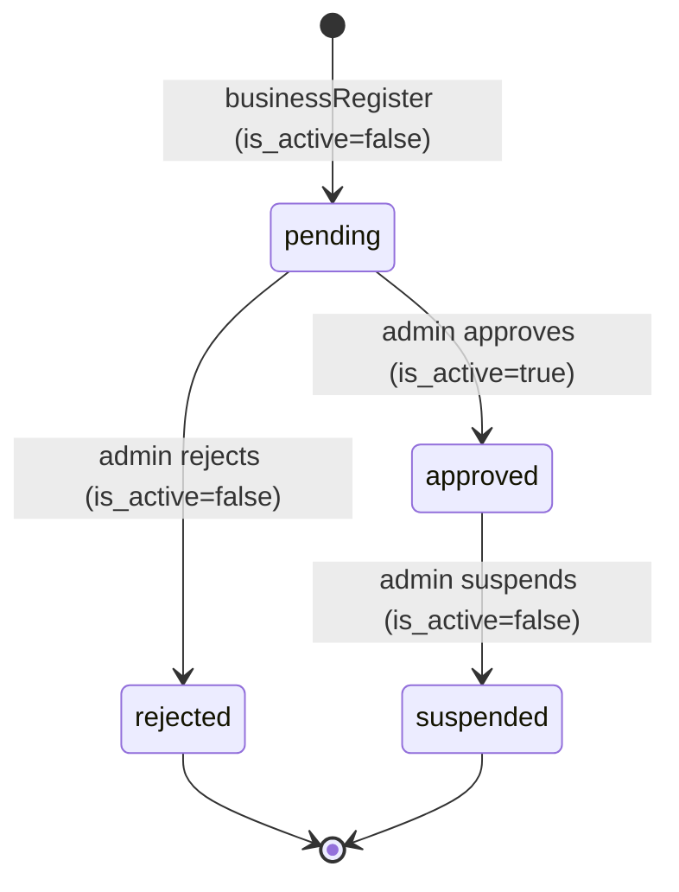
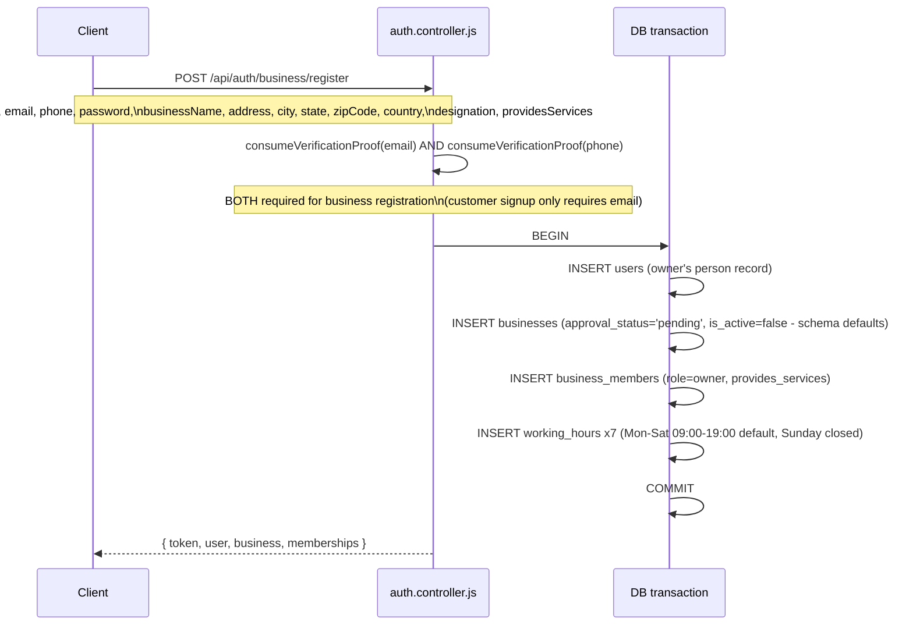
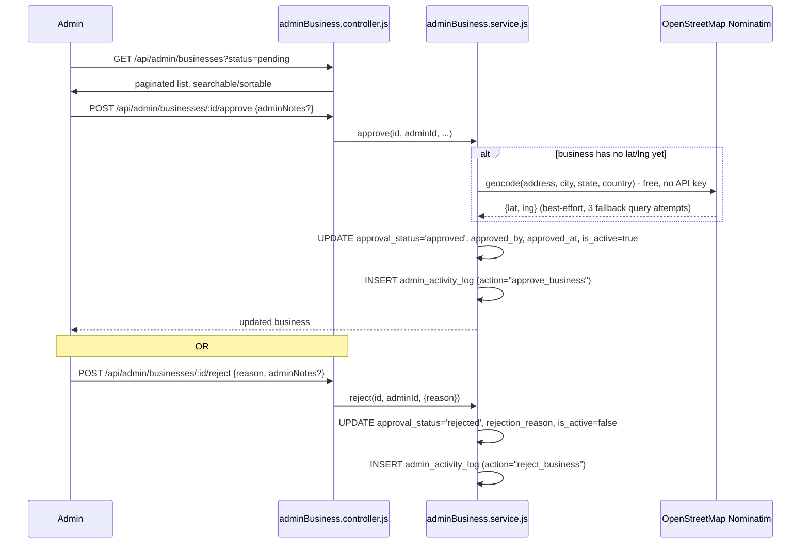
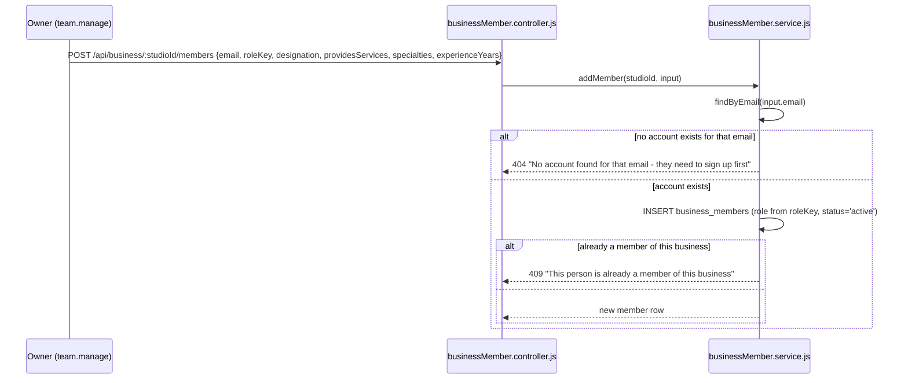

# Business Onboarding Flow

Source: `src/services/auth.service.js#businessRegister`, `src/services/business.service.js`, `src/services/businessMember.service.js`, `src/services/adminBusiness.service.js`.

## Status states

`businesses.approval_status` is a DB `CHECK` constraint: `pending | approved | rejected | suspended`. A business is only visible to customer discovery (`/api/discover/*`) when `approval_status = 'approved' AND is_active = true` — `pending`, `rejected`, and `suspended` are all invisible there regardless of what the owner sees on their own dashboard (`/api/business/:studioId`, which has no such filter — an owner can always see and manage their own business).

## 1. Registration (self-service, single transaction)

Notable details:
- **Both email and phone verification are required** for business registration (customer signup only requires email) — a stricter bar since a business is a public-facing storefront, not just a person browsing.
- **Business slug collision handling**: `createBusinessCore` slugifies the business name and retries with `-2`, `-3`, ... on a Postgres unique-violation, up to 5 attempts. Each retry runs in its own nested transaction (a Postgres `SAVEPOINT` via `trx.transaction(...)`) — a naive retry inside the same outer transaction doesn't work because Postgres poisons the entire transaction after any failed statement until an explicit rollback, so only the failed slug attempt rolls back, not the user/business-member rows already staged in the outer transaction.
- **Default working hours are seeded automatically**: Mon–Sat 09:00–19:00, Sunday closed. The owner can change these afterward via `PUT /api/business/:studioId/working-hours` (requires `settings.manage`).
- If registration fails at any step, **nothing is created, including the user account** — it's one atomic transaction, not a multi-step wizard with partial state.
- An already-logged-in user opening a *second* business uses a different, simpler endpoint — `POST /api/business/` (`business.controller.js#createBusiness`) — which reuses the exact same `createBusinessCore` transaction body, just without the user-creation step.

## 2. Pending: invisible to customers, visible to the owner

Immediately after registration, the business exists and the owner can fully manage it (services, working hours, team) via `/api/business/:studioId/*` — but it will not appear in `/api/discover/*` search/map/detail results until an admin approves it. This is intentional: owners can finish setting up their catalog and team before going live.

## 3. Admin review

- **Geocoding is automatic on approval** if the business doesn't already have coordinates — uses OpenStreetMap's free Nominatim API (no API key needed), tries progressively less specific queries (full address → city+state+country → city+country) until one resolves. A geocoding failure doesn't block approval; `lat`/`lng` just stay null (the business simply won't appear on the map view, but still appears in non-map discovery listing).
- **Every admin action on a business is audit-logged** to `admin_activity_log` (`approve_business`, `reject_business`, `suspend_business`, `update_business`, `geocode_business`) with the acting admin's ID, an IP address, and action-specific JSON details (e.g., rejection reason, which fields changed).
- **`reject` requires a `reason`** — a 400 if omitted, so a rejection is never silently unexplained in the audit log.
- There is currently **no automated email to the owner** on approval/reject/suspend — `adminBusiness.service.js` updates the DB and logs the activity but never calls `email.service.js`. This is a known, flagged gap (see [`PRODUCTION_READINESS.md`](../PRODUCTION_READINESS.md) tech debt list), not an oversight in this doc.

## 4. Suspension (post-approval)

`POST /api/admin/businesses/:id/suspend` — sets `approval_status='suspended', is_active=false`. There is **no un-suspend endpoint** — restoring a suspended business currently requires a direct `PUT /api/admin/businesses/:id` (which can set arbitrary fields, including implicitly restoring visibility only if paired with a manual `approval_status` change — in practice this needs a DB-level fix today). Deliberately not added as a symmetric pair in the Admin migration phase; flagged as a real decision to make, not a silent omission, whenever business moderation gets frontend UI.

## 5. Team member onboarding (adding staff to an existing business)

**Deliberately does not create a new user account or send an invite email.** The person being added must already have a Revoras account (customer or business) under that exact email — `addMember` links an *existing* `users` row to the business via a new `business_members` row. Account creation and any invite-notification flow are explicitly out of this scope (flagged in the source as later work, not yet built).

Once added, the new member can immediately log in via the same unified `POST /api/auth/business/login` endpoint — their login response's `memberships` array will now include this business, with permissions resolved from their assigned role (see [`rbac-model.md`](./rbac-model.md)).

**Removing/demoting the last owner is blocked** (`assertNotLastOwner`) — a business owned by no one is treated as an invalid state, enforced as a genuine business invariant in the service layer (not a permission check — `team.manage` is still required to even attempt it).

## Known gaps

- No email notification to the owner on approve/reject/suspend.
- No un-suspend endpoint (manual DB fix required today).
- No invite-email flow for adding a team member who doesn't yet have an account — they must self-register first, then get added.
- No staff-registration fee enforcement despite schema support (`business_members.registration_fee_paid`/`registration_fee_amount`) — see [`payment-lifecycle.md`](./payment-lifecycle.md#staff-registration-fee-schema-supported-not-currently-enforced).
