# Database Schema

Source of truth: `db/migrations/` (Knex, 29 files as of 2026-07-14). Schema is managed entirely by versioned migrations — there is no runtime schema sync. Run `npm run db:migrate:status` against a live database to confirm this doc matches reality before relying on it.

## ER Diagram

```mermaid
erDiagram
    USERS ||--o{ BUSINESS_MEMBERS : "has memberships"
    USERS ||--o{ BOOKINGS : "makes"
    USERS ||--o{ PAYMENTS : "pays (nullable)"
    USERS ||--o{ REVIEWS : "writes"
    USERS ||--o{ REVIEW_HELPFUL : "votes"
    USERS ||--o{ FAVORITES : "favorites"
    USERS ||--o{ NOTIFICATIONS : "receives"
    USERS ||--o{ PASSWORD_RESET_TOKENS : "requests"

    ADMINS ||--o{ ADMIN_ACTIVITY_LOG : "performs"
    ADMINS ||--o{ BUSINESSES : "approves (nullable)"

    CATEGORIES ||--o{ BUSINESSES : "classifies (type=business)"
    CATEGORIES ||--o{ SERVICES : "classifies (type=service)"

    ROLES ||--o{ BUSINESS_MEMBERS : "grants base role"
    ROLES ||--o{ ROLE_PERMISSIONS : "has"
    PERMISSIONS ||--o{ ROLE_PERMISSIONS : "granted via"
    PERMISSIONS ||--o{ BUSINESS_MEMBER_PERMISSION_OVERRIDES : "overridden via"

    BUSINESSES ||--o{ BUSINESS_MEMBERS : "employs"
    BUSINESSES ||--o{ SERVICES : "offers"
    BUSINESSES ||--o{ WORKING_HOURS : "is open per"
    BUSINESSES ||--o{ BOOKINGS : "hosts"
    BUSINESSES ||--o{ TIME_OFF : "hosts"
    BUSINESSES ||--o{ REVIEWS : "receives"
    BUSINESSES ||--o{ FAVORITES : "favorited as"
    BUSINESSES ||--o{ BUSINESS_GALLERY_IMAGES : "has gallery images"

    BUSINESS_MEMBERS ||--o{ BUSINESS_MEMBER_PERMISSION_OVERRIDES : "has overrides"
    BUSINESS_MEMBERS ||--o{ BOOKINGS : "serves"
    BUSINESS_MEMBERS ||--o{ TIME_OFF : "blocks"
    BUSINESS_MEMBERS ||--o{ REVIEWS : "reviewed as (nullable)"

    SERVICES ||--o{ BOOKING_SERVICES : "line item"

    BOOKINGS ||--o{ BOOKING_SERVICES : "contains"
    BOOKINGS ||--o| REVIEWS : "reviewed once"
    PAYMENTS ||--o| BOOKINGS : "settles (nullable)"

    REVIEWS ||--o{ REVIEW_HELPFUL : "voted helpful"

    USERS {
        uuid id PK
        string email UK
        string phone UK
        string password
        string google_id UK
        boolean email_verified
        boolean phone_verified
        boolean is_active
        int token_version
        int failed_login_attempts
        timestamp locked_until
    }

    ADMINS {
        uuid id PK
        string email UK
        string password
        string role "admin | super_admin"
        boolean is_active
    }

    BUSINESSES {
        uuid id PK
        string slug UK
        uuid category_id FK
        uuid approved_by FK
        string approval_status "pending|approved|rejected|suspended"
        boolean is_active
        double lat
        double lng
        decimal rating
    }

    BUSINESS_MEMBERS {
        uuid id PK
        uuid studio_id FK
        uuid user_id FK
        uuid role_id FK
        boolean provides_services
        string status "invited|active|inactive|suspended"
        boolean registration_fee_paid
    }

    BUSINESS_GALLERY_IMAGES {
        uuid id PK
        uuid studio_id FK
        string url
        int sort_order
        boolean is_cover
    }

    ROLES {
        uuid id PK
        string key UK "owner | staff"
        boolean is_system
    }

    PERMISSIONS {
        uuid id PK
        string key UK
    }

    ROLE_PERMISSIONS {
        uuid role_id FK
        uuid permission_id FK
    }

    BUSINESS_MEMBER_PERMISSION_OVERRIDES {
        uuid business_member_id FK
        uuid permission_id FK
        boolean granted
    }

    CATEGORIES {
        uuid id PK
        string slug UK
        string type "business | service"
    }

    SERVICES {
        uuid id PK
        uuid studio_id FK
        uuid category_id FK
        decimal price
        int duration
        boolean is_active
    }

    WORKING_HOURS {
        uuid id PK
        uuid studio_id FK
        int day_of_week "0-6"
        time open_time
        time close_time
        boolean is_closed
    }

    BOOKINGS {
        uuid id PK
        uuid user_id FK
        uuid studio_id FK
        uuid business_member_id FK
        date booking_date
        time start_time
        time end_time
        string status "pending|confirmed|completed|cancelled|no_show"
        uuid payment_id FK
        string confirmation_code UK
    }

    TIME_OFF {
        uuid id PK
        uuid studio_id FK
        uuid business_member_id FK
        date date
        boolean is_full_day
    }

    BOOKING_SERVICES {
        uuid id PK
        uuid booking_id FK
        uuid service_id FK
        decimal price
        int duration
    }

    PAYMENTS {
        uuid id PK
        string payable_type "booking | staff_registration (polymorphic, not FK)"
        uuid payable_id "polymorphic, not FK"
        uuid user_id FK
        string status "pending|paid|failed|refunded"
        string razorpay_order_id
        string razorpay_payment_id UK
    }

    REVIEWS {
        uuid id PK
        uuid user_id FK
        uuid booking_id FK "UK, nullable"
        uuid studio_id FK
        uuid business_member_id FK "nullable"
        int rating "1-5"
    }

    REVIEW_HELPFUL {
        uuid id PK
        uuid review_id FK
        uuid user_id FK
    }

    FAVORITES {
        uuid id PK
        uuid user_id FK
        uuid studio_id FK
    }

    NOTIFICATIONS {
        uuid id PK
        uuid user_id FK
        string type
        string channel "in_app|email|sms|push"
        string status "pending|sent|failed|read"
    }

    VERIFICATIONS {
        uuid id PK
        string identifier "email or phone, not FK"
        string otp
        boolean consumed
        timestamp expires_at
    }

    PASSWORD_RESET_TOKENS {
        uuid id PK
        uuid user_id FK
        string token_hash UK "SHA-256"
        boolean consumed
    }

    ADMIN_ACTIVITY_LOG {
        uuid id PK
        uuid admin_id FK
        string action
        string entity_type
        uuid entity_id
    }
```



## Design notes that shape every query against this schema

- **`users` is the single identity table** for every human who isn't a platform admin — customers and business owners/staff are the same row type. `users` never references `businesses` directly. **`business_members` is the only bridge** between a Business and a Person (one row per `(studio_id, user_id)` pair, enforced by a unique constraint).
- **`admins` is a deliberately separate identity** from `users` — different table, different JWT shape (`{id, role}` vs `{id, tv}`), different login endpoint, no shared code path. A compromised customer/business account has no route to admin privileges.
- **`provides_services` (not role) is what makes a business member bookable as a Professional.** An Owner may or may not provide services themselves (the Indian-market "owner who also cuts hair" case); a future Receptionist role never would.
- **`categories` is one table serving two taxonomies**, distinguished by `type`: `business` (what kind of establishment — Barbershop, Salon, ...) and `service` (what a service is — Haircut, Beard, ...). Not two parallel tables.
- **`payments.payable_id` is polymorphic, not a foreign key.** `payable_type` is either `'booking'` or `'staff_registration'`; Postgres can't express an FK targeting either of two tables, so referential integrity for that pointer is enforced in the service layer, not the database. Every other FK in the schema is a real FK.
- **Double-booking is prevented at the database level**, not just in application code: `bookings` carries a Postgres `EXCLUDE USING gist` constraint —
  ```sql
  ALTER TABLE bookings
  ADD CONSTRAINT excl_bookings_no_overlap
  EXCLUDE USING gist (
    business_member_id WITH =,
    tsrange(booking_date + start_time, booking_date + end_time) WITH &&
  )
  WHERE (status <> 'cancelled');
  ```
  The application also takes a `pg_advisory_xact_lock` on the business member before checking for conflicts (see `booking.service.js`) — the EXCLUDE constraint is the hard guarantee, the advisory lock avoids the ordinary case of two near-simultaneous requests both passing the pre-check.
- **FK `ON DELETE` behavior is deliberate per relationship**, not uniform:
  - `CASCADE` — genuinely dependent rows: `business_members`, `services`, `working_hours`, `time_off`, `booking_services`, `review_helpful`, `favorites`, `notifications`, `password_reset_tokens`, `business_member_permission_overrides`, `role_permissions`.
  - `RESTRICT` — rows that must block deletion of something still referenced: `business_members.role_id` (can't delete a role in use), `bookings.user_id`/`studio_id`/`business_member_id` (a booking is a legal/financial record, never silently orphaned), `booking_services.service_id`, `services.category_id`, `admin_activity_log.admin_id`.
  - `SET NULL` — optional references: `businesses.category_id`/`approved_by`, `payments.user_id`, `bookings.payment_id`, `reviews.booking_id`/`business_member_id`.
- **Every `id` is a `uuid` with `gen_random_uuid()` default** (requires the `pgcrypto`/built-in `gen_random_uuid()` — Postgres 13+ has this natively). No serial/bigint PKs anywhere in this schema.
- **Timestamps are `timestamptz`** (`useTz: true`) throughout — never naive `timestamp`.

## Roles & permissions (seed data, `db/seeds/01_roles.js`–`03_role_permissions.js`)

Two system roles today (a `Manager`/`Receptionist`/`Assistant` role is designed to be a data seed, not a migration, when needed):

| Role | Permissions granted |
|---|---|
| `owner` | All six: `bookings.manage`, `services.manage`, `team.manage`, `payments.view`, `settings.manage`, `analytics.view` |
| `staff` | `bookings.manage` only (scoped to their own bookings by query logic, not by a separate permission key) |

`business_member_permission_overrides` exists for per-member exceptions beyond the role default (e.g., trusting one specific staff member with `payments.view`) — table is live, no UI surface yet. See [`rbac-model.md`](./rbac-model.md) for how these combine into an effective permission set at request time.

## Categories (seed data, `db/seeds/04_categories.js`)

- **Business type** (`categories.type = 'business'`): Barbershop, Salon, Beauty Studio, Wellness & Spa, Nail Studio.
- **Service type** (`type = 'service'`): Haircut, Beard, Hair Color, Facial, Spa, Nails, Bridal, and a catch-all `Other` (fallback target for any unmatched free-text category during the Phase 2.2 migration backfill).

## Migration history (chronological)

| Migration | What it did |
|---|---|
| `20260711000001_drop_legacy_tables` | One-way cutover: drops every old `modelAttributeSync.js`-managed table (`studios`, `studio_owners`, `barbers`, `studio_hours`, `barber_time_off`, `user_favorites`, etc.), enables `btree_gist` extension for the later EXCLUDE constraint. `down()` is a deliberate no-op. |
| `20260711000002`–`000003` | `admins`, `admin_activity_log` |
| `20260711000004` | `users` |
| `20260711000005` | `categories` (business taxonomy only, at this point) |
| `20260711000006` | `businesses` |
| `20260711000007` | `roles`, `permissions`, `role_permissions` |
| `20260711000008` | `business_members` |
| `20260711000009` | `business_member_permission_overrides` |
| `20260711000010`–`000011` | `services`, `working_hours` |
| `20260711000012`–`000013` | `payments`, `bookings` (+ the EXCLUDE constraint) |
| `20260711000014`–`000015` | `time_off`, `booking_services` |
| `20260711000016`–`000018` | `reviews`, `review_helpful`, `favorites` |
| `20260711000019`–`000020` | `notifications`, `verifications` |
| `20260712000001` | Added `categories.type` (`business`/`service`) — categories now serves two taxonomies |
| `20260712000002` | Replaced `services.category` (free text) with `services.category_id` (FK, NOT NULL, RESTRICT), with an in-migration backfill matching old free-text values to the new taxonomy, falling back to `Other` |
| `20260713000001` | Added `users.token_version`, `failed_login_attempts`, `locked_until` (JWT revocation + account lockout) |
| `20260713000002` | `password_reset_tokens` (replaced an in-memory `Map` that didn't survive a restart) |
| `20260714000001` | `business_gallery_images` (Phase 1.1 V4 roadmap - multi-image business gallery, one row per image rather than a jsonb array so ordering/cover-selection/delete are per-row operations) |
| `20260714000002` | Phase 1.2 - additive Business Information & Trust Layer fields on `businesses`: scalar `website`; jsonb `social_links`/`policies` (objects, default `{}`), `languages`/`payment_methods`/`accessibility`/`house_rules` (arrays, default `[]`). Columns on `businesses` rather than a side table (1:1, all-optional, mirrors the existing `amenities` jsonb). |
| `20260714000003` | Phase 1.3a - additive Professional Profile fields on `business_members`: `bio` (text); jsonb `social_links` (object), `languages`/`education`/`certifications`/`awards`/`featured_service_ids` (arrays). Reuses existing `specialties` (= specializations) and `experience_years`. Portfolio/certificate *image* uploads (1.3b) are a separate later table. |
| `20260714000004` | Phase 1.3b - two per-row professional media tables: `member_portfolio` (`media_url`, `thumbnail_url`, `caption`, `sort_order`, `is_cover`) and `member_certificates` (`title`, `issuer`, `issued_date`, `expiry_date`, `credential_id`, `verification_url`, `media_url`, `sort_order`). Both FK → `business_members` CASCADE, indexed `(business_member_id, sort_order)`. Mirrors `business_gallery_images` (keyed by member instead of studio). Uploads via MediaService → R2 folders `portfolios`/`certificates`. |
| `20260714000005` | Phase 1.3c - certificate consolidation: migrates the temporary jsonb `business_members.certifications` (1.3a) into `member_certificates` and **drops the column**. `member_certificates` is now the single source of truth for professional certificates. |
| `20260714000006` | Phase 1.4a - `trust_scores` (one cached row per business): computed 0-100 `score` + raw metrics (`rating`, `review_count`, `completed_bookings`, `cancellation_rate`, `no_show_rate`, `profile_completion`, `avg_response_minutes`, `business_age_days`, `verified`). FK → `businesses` CASCADE; indexed on `score` for discovery ranking. Recomputed by `trust.service`. |
| `20260715000006` | Phase 2.2 - additive Featured fields on `businesses`: `is_featured`, `featured_priority`, `featured_start_at`/`featured_end_at` (publish window), `featured_region` (targeting). Feeds the `ranking.service` boost and the `featuredOnly` discovery filter. A boost is deliberately bounded so it cannot outrank genuine relevance. |
| `20260715000007` | Phase 2.2 - `collections` + `collection_items` (editorial curation). `collections` stores presentation (`title`, `subtitle`, `slug` unique, `cover_image_url`, `description`, `display_order`), a publish window (`is_active`, `start_at`/`end_at`), region targeting (`target_city`/`target_state`), and membership *rules* (`filter_category_id`, `filter_min_rating`, `filter_verified_only`, `filter_premium_only`) — the same vocabulary as the Phase 2.1 discovery query params. **No new query engine**: membership resolves at read time by calling `discovery.repository.listBusinesses` with those columns, so a newly-approved matching business joins automatically. `collection_items` holds only manually *pinned* picks (unique `(collection_id, business_id)`, ordered by `sort_order`, CASCADE on both FKs); pinned businesses appear regardless of whether they match the filter — that's the curator override. |

| `20260715000008` | Phase 2.3 - professional favorites. Drops `favorites.studio_id` NOT NULL, adds nullable `business_member_id` (FK → `business_members`, CASCADE) + `uq_favorites_user_member`, and `CHECK (num_nonnulls(studio_id, business_member_id) = 1)` so every row targets exactly one thing. One table rather than a second `professional_favorites` (decision D3): the Saved page lists studios and professionals newest-first, which is one ordered query here and a UNION across two repositories otherwise. Not the polymorphic `favoritable_type` pattern §2.0 rejects — both columns are real FK-enforced references. The pre-existing `uq_favorites_user_studio` still works: Postgres treats NULLs as distinct, so professional rows don't collide under it. |
| `20260715000009` | Phase 2.3 - `recently_viewed` (server-side view history for signed-in users; anonymous visitors keep the localStorage store). Mirrors the `favorites` shape (nullable `studio_id`/`business_member_id` + exactly-one CHECK) so "saved" and "recently viewed" answer the same business-or-professional question the same way. **Dedup is the unique index, not app code**: one row per (user, target), and recording a repeat view UPSERTs `viewed_at` — insert-then-prune would race on a double-click and force every read to dedup in JS. Uniques are deliberately **non-partial**: Postgres can't infer a partial index from a bare `ON CONFLICT (cols)` without repeating the predicate, which knex can't emit, so a partial index breaks the very UPSERT that powers dedup. Indexed `(user_id, viewed_at)` for the read path. No pruning — see report.md §V4.12. |
| `20260715000010` | Phase 2.4 - `offers` + `offer_services`. `offers` holds the rule (native enums `discount_type` flat/percentage, `discount_value`, `max_discount_amount` cap, `min_spend`, `applies_to` business/services, publish window `start_at`/`end_at` + `is_active`, usage guards `max_uses`/`max_uses_per_user`/`first_time_only`). `offer_services` scopes an offer to specific services when `applies_to='services'` (unique `(offer_id, service_id)`, CASCADE both). Discount math + "which offer wins" live in `offer.engine.js`, not the schema. Usage is counted live from `bookings.offer_id` — no counter column. |
| `20260715000011` | Phase 2.4 - booking offer snapshot: `bookings` gains `offer_id` (FK → offers, **ON DELETE SET NULL** so deleting an offer keeps past bookings), `original_amount` (pre-discount), `discount_amount`. `total_amount` keeps its meaning as the payable figure and becomes post-discount — so `payment.service.js` is unchanged. Snapshot, not recompute-on-read: editing/expiring an offer must never change a past booking's price. A single `offer_id` = the no-double-discount guarantee. |
| `20260715000012` | Phase 2.4 - seeds the `offers.manage` permission and grants it to the `owner` role (staff excluded), so `migrate:latest` alone makes offers usable in an existing DB (seeds run manually and wouldn't backfill). Idempotent upserts; the same row is also in `db/seeds/02_permissions.js` for fresh databases. |
| `20260715000013` | Phase 2.5 (Booking Experience) - three changes: (1) widens `chk_bookings_status` to add `checked_in` (drop+re-add, Postgres has no ALTER CHECK) - the strict transition matrix itself lives in `bookingStateMachine.js`, this is just the DB backstop against an unknown status ever being written. (2) `booking_status_events` - an append-only log, one row per transition (`from_status`/`to_status`/`actor_type` customer\|business\|system/`actor_id`/`reason`), which IS the "timeline" - deliberately an event log rather than per-status timestamp columns, so a future non-status event ("reminder sent") is another row, not another migration. (3) `businesses.cancellation_policy` jsonb (defaulted `{freeBeforeHours:24, feePercentAfter:50, noCancelWithinHours:2}` so every existing business is instantly policy-aware with no backfill) + `bookings.cancellation_fee` (frozen at cancel time, mirrors the offer-snapshot pattern from 20260715000011 - editing a policy later must never rewrite what a past cancellation cost). Down migration rolls any `checked_in` rows back to `confirmed` before reverting the constraint (a rollback discards the feature the status represents). |

> **Note:** this table is missing `20260715000001`–`20260715000005` (Phase 1.4b verification tables, 1.5 lifecycle/onboarding/subscriptions, and the Phase 2.1 discovery GIN indexes). Those rows were never backfilled by the phases that added them; `npm run db:migrate:status` is authoritative. Recorded here rather than silently backfilled — documenting migrations this session didn't verify would be exactly the kind of unearned claim §V4.11 of report.md exists to warn about.

## Commands

```bash
npm run db:migrate          # apply all pending migrations
npm run db:migrate:rollback # roll back the last batch
npm run db:migrate:status   # show applied/pending
npm run db:migrate:make <name>
npm run db:seed             # reference data only (roles/permissions/categories) - production-safe
npm run db:seed:dev         # opt-in dev/demo fixtures from db/seeds/dev/ - never in production
npm run db:seed:make <name>
```
