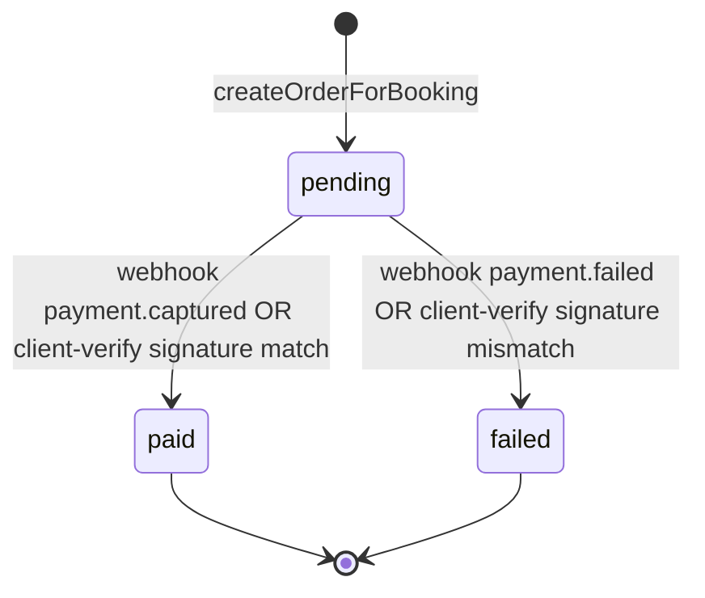

# Payment Lifecycle

Source: `src/services/payment.service.js`, `src/controllers/payment.controller.js`, `src/config/razorpay.js`, `db/migrations/20260711000012_create_payments_table.js`.

## Provider: Razorpay, server-authoritative

All payment state changes are driven by the `payments` table, which centralizes what used to be scattered across ad hoc `bookings.razorpay_*` columns. Razorpay is the only payment provider integrated. If `RAZORPAY_KEY_ID`/`RAZORPAY_KEY_SECRET` aren't set, payment endpoints return a clean `503 "Payments are not configured on this server yet"` — not a crash (`isRazorpayConfigured()` guard).

## Status states



`payments.status` is a DB `CHECK` constraint: `pending | paid | failed | refunded` (`refunded` is schema-supported, no code path sets it yet — no refund flow exists).

## The two confirmation paths — webhook is authoritative, client-verify is a UX shortcut

**This is the single most important thing to understand about this flow**: there are two ways a payment gets marked `paid`, and they race, but only one is trusted as the actual source of truth.

```mermaid
sequenceDiagram
    participant C as Client (browser)
    participant RP as Razorpay
    participant API as payment.controller.js
    participant Svc as payment.service.js
    participant DB as payments / bookings

    C->>API: POST /api/payments/create-order {bookingId}
    API->>Svc: createOrderForBooking({bookingId, userId})
    Svc->>Svc: reject if already paid; compute amount in paise
    Svc->>RP: razorpay.orders.create({amount, currency:"INR", receipt, notes:{bookingId}})
    RP-->>Svc: order {id, amount, currency}
    Svc->>DB: BEGIN: INSERT payments (status=pending, razorpay_order_id), UPDATE bookings.payment_id
    Svc-->>C: {orderId, amount, currency, keyId, bookingId, paymentId}

    Note over C,RP: Client opens Razorpay Checkout widget using keyId+orderId

    par Path A: Client-side verify (best-effort, UX speed)
        RP-->>C: razorpay_payment_id, razorpay_order_id, razorpay_signature
        C->>API: POST /api/payments/verify {bookingId, razorpay_order_id, razorpay_payment_id, razorpay_signature}
        API->>Svc: verifyClientPayment(...)
        Svc->>Svc: HMAC-SHA256(orderId|paymentId, KEY_SECRET) === signature ?
        alt signature valid
            Svc->>DB: markPaid(payment.id), confirmIfPending(booking)
            Svc->>Svc: notifyPaymentSuccess (best-effort, post-commit)
        else signature invalid
            Svc->>DB: markFailed(payment.id)
            Svc-->>API: 400 "Payment verification failed"
        end
    and Path B: Razorpay server-to-server webhook (source of truth)
        RP->>API: POST /api/payments/webhook {event, payload} + X-Razorpay-Signature header
        API->>API: HMAC-SHA256(rawBody, RAZORPAY_WEBHOOK_SECRET) === header ?
        alt signature invalid
            API-->>RP: 400 "Invalid webhook signature"
        else signature valid
            API->>Svc: applyWebhookEvent({event, payment})
            alt event = payment.captured
                Svc->>DB: markPaid(payment.id), confirmIfPending(booking)
                Svc->>Svc: notifyPaymentSuccess (best-effort, post-commit)
            else event = payment.failed
                Svc->>DB: markFailed(payment.id)
            end
            API-->>RP: 200 {received:true} (always 200, even on internal error - avoids retry-storms)
        end
    end
```

**Why the webhook is authoritative**: the client-verify path only fires if the browser tab stays open and the network call succeeds — a closed tab, a network drop, or a client crash right after payment means `verifyClientPayment` never runs. The webhook is Razorpay calling *your server* directly, independent of what the client does, so it's the only path guaranteed to eventually fire for a real successful payment.

**Idempotency**: `markPaid` is a no-op update once a payment is already `paid` (checked before writing) — so whichever of the two paths gets there first is the one that actually transitions state and fires notifications; the other is a safe no-op. This is why `verifyClientPayment` explicitly returns `{verified: true, alreadyVerified: true}` when it discovers the webhook already beat it there, instead of erroring.

## Signature verification (two different HMACs, don't confuse them)

| Path | What's signed | Secret | Header/params |
|---|---|---|---|
| Client-verify | `${razorpay_order_id}|${razorpay_payment_id}` | `RAZORPAY_KEY_SECRET` | Fields in the POST body |
| Webhook | Raw request body bytes | `RAZORPAY_WEBHOOK_SECRET` | `X-Razorpay-Signature` header |

The webhook verification needs the **exact raw bytes** Razorpay signed, which is why `server.js`'s `express.json()` middleware has a `verify` hook that stashes `req.rawBody = buf` before JSON-parsing — parsing and re-stringifying would not reliably reproduce byte-identical output.

If `RAZORPAY_WEBHOOK_SECRET` isn't set, the webhook handler returns `503` immediately and logs a warning — it does not silently accept unverified webhook calls.

## Booking confirmation trigger

`confirmIfPending(bookingId)` runs inside the **same transaction** as `markPaid` — a booking only flips from `pending` to `confirmed` once its payment is durably recorded as `paid`, never optimistically before that.

## Post-payment notifications

`notifyPaymentSuccess` fires two notifications (`notifyPaymentReceived`, `notifyBookingConfirmed`) via `Promise.all`, deliberately **after** the transaction commits, wrapped in try/catch that only logs — never throws. This matters specifically for the webhook path: if a notification failure were allowed to throw, the webhook handler would return a non-2xx status to Razorpay for a payment that, in fact, was already successfully recorded — triggering pointless retry storms from Razorpay's side for a "failure" that isn't real.

## Staff registration fee (schema-supported, not currently enforced)

`payments.payable_type` supports `'staff_registration'` alongside `'booking'`, and `business_members` has `registration_fee_paid`/`registration_fee_amount` columns — but no current code path creates a `staff_registration` payment or enforces the fee. This is scaffolding for a feature that isn't wired up yet, not a bug.

## Known gaps

- **No refund flow.** `payments.status` supports `'refunded'` in its CHECK constraint, but nothing sets it.
- **No staff-registration payment enforcement**, despite schema support (see above).
