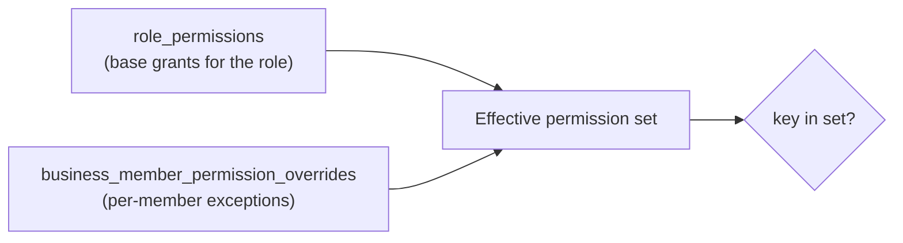

# RBAC (Role-Based Access Control) Model

Source: `src/middlewares/businessMember.middleware.js`, `src/middlewares/requirePermission.middleware.js`, `src/services/permission.service.js`, `src/repositories/permission.repository.js`, `db/seeds/01_roles.js`–`03_role_permissions.js`.

## Principle: DB-driven, never a hardcoded role string

Nowhere in the business-side codebase does a controller or service check `if (role === "owner")`. Every authorization decision resolves through `role_permissions` (+ per-member overrides) at request time. Adding a new role (Manager, Receptionist, Assistant) is a **data seed**, never a code change or migration.

Admin authorization is the one deliberate exception — see [`auth-flow.md`](./auth-flow.md#admin-login) and the note at the bottom of this doc.

## Three composable middlewares, not one combined check

Business-scoped routes (`/api/business/:studioId/*`) chain three separate middlewares, each with one job:

```
authenticate  →  requireBusinessMember  →  requirePermission("key")
(who is this)    (are they a member       (are they allowed to do
                   of THIS business)        THIS specific thing)
```

This is deliberate — report.md's Phase 2.3 plan explicitly called out "avoid combining authentication and authorization into a single middleware," replacing a Phase 2.1 placeholder (`authenticateBusinessMember`) that did all three at once and, crucially, **treated every active member as authorized for everything** with no permission-key checking at all.

### 1. `authenticate` — who is this person
Covered in [`auth-flow.md`](./auth-flow.md). Sets `req.user`.

### 2. `requireBusinessMember` — are they a member of this business
```js
// src/middlewares/businessMember.middleware.js
const studioId = req.params.studioId || req.body.studioId;
const membership = await businessMemberRepo.findActiveMembership({ userId: req.user.id, studioId });
if (!membership) return res.status(403).json({ error: "Not a member of this business" });
req.businessMember = membership; // includes role_id
```
Any *active* owner or staff member passes this check — it says nothing yet about what they can *do*. Read (`GET`) endpoints in `businessOperations.routes.js` only require this middleware; any active member can view.

### 3. `requirePermission(key)` — the specific action
```js
// src/middlewares/requirePermission.middleware.js
const allowed = await permissionService.hasPermission(req.businessMember.id, req.businessMember.role_id, key);
if (!allowed) return res.status(403).json({ error: `Missing permission: ${key}` });
```
Applied per-mutation-route with the specific key that action requires — a staff member can be trusted with `services.manage` without also getting `team.manage` or `settings.manage`.

## Permission resolution: Role grants → Member overrides → Effective set



```js
// src/services/permission.service.js
export const getEffectivePermissions = async (businessMemberId, roleId) => {
  const [baseKeys, overrides] = await Promise.all([
    permissionRepo.listPermissionKeysForRole(roleId),
    permissionRepo.listOverridesForMember(businessMemberId),
  ]);

  const effective = new Set(baseKeys);
  for (const { key, granted } of overrides) {
    if (granted) effective.add(key);   // ADDS a key the role doesn't have
    else effective.delete(key);        // REVOKES a key the role does have
  }
  return effective;
};
```

- Start with the role's base grants (`role_permissions`).
- Layer `business_member_permission_overrides` on top: `granted: true` **adds** a permission beyond the role's default; `granted: false` **revokes** one the role would otherwise grant.
- This resolves **fresh on every request** — never cached in the JWT, never cached in a session. A permission change takes effect on the member's very next request.

The overrides table is live in the schema but has **no UI surface yet** (report.md explicitly scoped it as future-proofing, not V2 UI work) — it costs nothing to have ready for the day one specific staff member needs, say, `payments.view` without a role change.

## Roles and their default grants (current seed data)

| Role key | Grants |
|---|---|
| `owner` | All six permissions: `bookings.manage`, `services.manage`, `team.manage`, `payments.view`, `settings.manage`, `analytics.view` |
| `staff` | `bookings.manage` only |

## Permission keys and what they gate

| Key | Gates |
|---|---|
| `settings.manage` | `PATCH/DELETE /api/business/:studioId`, `PUT /api/business/:studioId/working-hours` |
| `team.manage` | `POST/PATCH/DELETE /api/business/:studioId/members*` |
| `services.manage` | `POST/PATCH/DELETE /api/business/:studioId/services*` |
| `analytics.view` | `GET /api/business/:studioId/analytics` |
| `payments.view` | Seeded, **not yet gating any route** — reserved for a future payments-list endpoint |
| `bookings.manage` | Staff's default grant; booking mutation endpoints (`/api/bookings/*`) currently only require `authenticate` (any logged-in person can book for themselves) — this key is scoped for future business-side booking management, not yet enforced as a route gate |

`GET /api/business/:studioId/dashboard`, `/members`, `/services`, `/working-hours`, `/time-off` require only `requireBusinessMember` (any active member can read) — no permission key. Time-off (`/time-off*`) deliberately has no permission-key gate at all: a staff member managing their own blocked time isn't a privilege-escalation question, so the controller just scopes queries to the requester's own `business_member_id` instead.

## Where authorization does *not* live

Per report.md's Phase 2.3 rule ("controllers/services hold no permission logic"), `business.service.js`, `businessMember.service.js`, and `service.service.js` contain **zero** role/permission checks — that logic was deliberately removed from the service layer during the RBAC migration and now lives entirely in `requirePermission` at the route level. The one exception that stayed in a service is a genuine business invariant, not authorization: `businessMember.service.js` blocks demoting/removing the last remaining owner of a business, because a business owned by no one is an invalid state regardless of who's asking.

## Admin: a separate, simpler model (by design)

Admin authorization is **not** part of this pipeline. `authenticateAdmin` + `requireAdmin` (`src/middlewares/auth.middleware.js`) is a plain two-tier check (`role === "admin" || role === "super_admin"`) against the JWT's `role` claim, straight from the `admins` table — no `business_members`, no `role_permissions`, no per-resource keys. A few admin actions (creating another admin, listing all admins) additionally require `super_admin` specifically, enforced inline in `admin.service.js#assertSuperAdmin` rather than as route middleware. This is a deliberate architectural choice (report.md: "keep Admin isolated from the Business permission model") — don't try to unify it with the business RBAC system.
